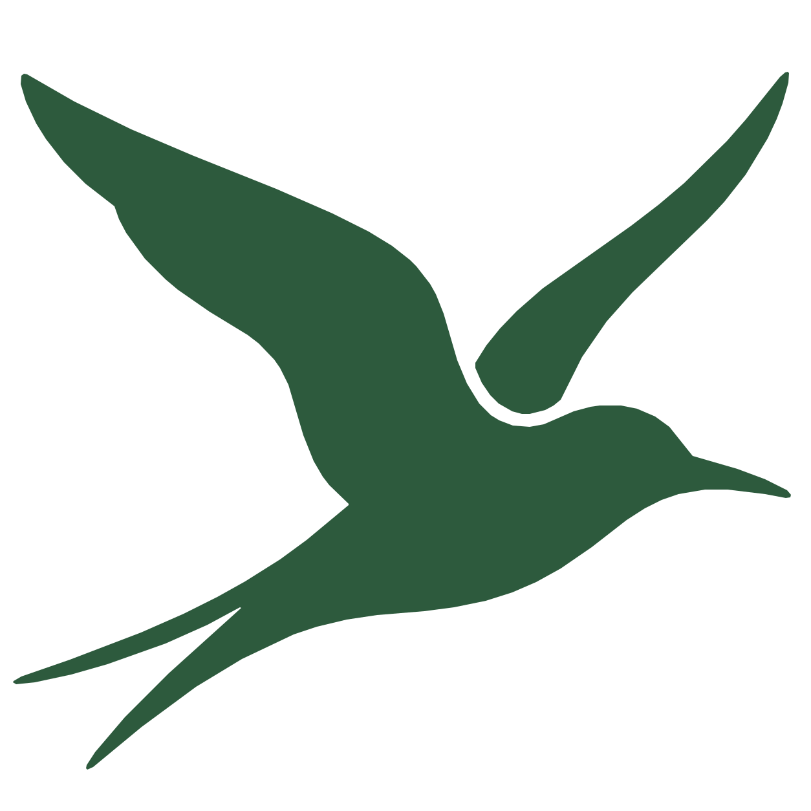
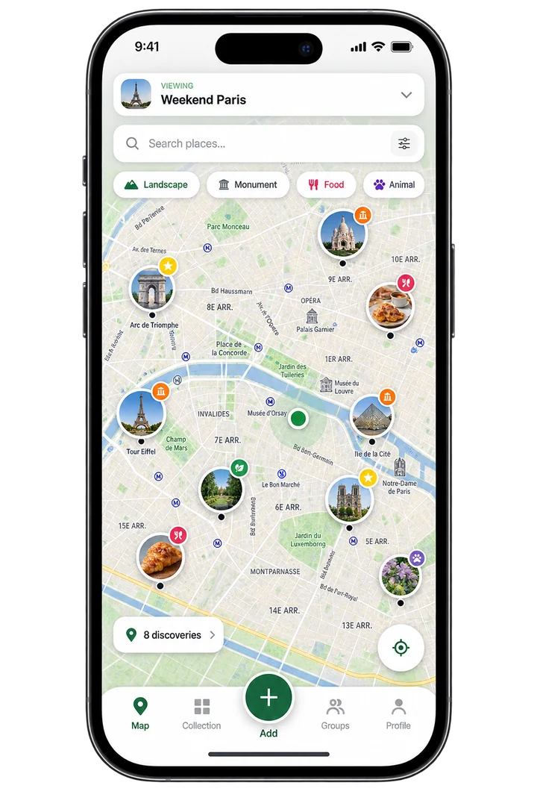

<div align="center">
  
  <h1>Sterna</h1>
  <p>A mobile-first application for turning geolocated photos into a personal and shared map of discoveries.</p>
  <p><a href="https://www.sterna-app.ch/">Website</a></p>
</div>

<div align="center">
  <a href="https://www.sterna-app.ch/">
    
  </a>
</div>

## About

Travel photos usually remain in a gallery, where the geographic story of a trip is difficult to see and revisit. This is even more fragmented when several people travel together and their memories stay on separate devices.

Sterna turns photos into geolocated discoveries. Discoveries appear on a map and progressively build a visual representation of the countries explored. They can also be shared through groups, so several users can contribute to a common map while each discovery keeps its author.

## Core features

The MVP is built around four closely related concepts:

### Discover countries

A country containing at least one discovery in the active map is considered visited in the MVP. Adding discoveries therefore builds a progressively visual representation of the countries explored.

### Geolocated discoveries

A photo becomes a discovery with a geographic position. Sterna attempts to use GPS coordinates available in the photo metadata. If they are missing or incorrect, the user can choose or correct the position manually on the map.

### Personal exploration map

The user's discoveries appear on a personal interactive map. The map is the central interface for viewing discoveries and the countries visited in the active context.

### Shared group maps

Users can create or join groups. Each group has a shared map containing the discoveries that its members associate with it. Every discovery retains its author so that contributions remain identifiable.

The MVP also defines simple discovery categories, including Landscape, Monument, Food, Animal, Plant, Culture, and Other. Badges, challenges, recommendations, advanced statistics, and more detailed region or cell-based exploration are not presented as the core of this project.

## Tech Stack

The following choices are supported by the accepted architecture decisions, the current landing page configuration, or the repository's deployment configuration.

- **Application frontend:** a shared React/TypeScript application built with Vite, targeting the web as a PWA with `vite-plugin-pwa` and mobile platforms through Capacitor, along with React Router, TanStack Query, and the native Fetch API.
- **Backend and data:** a NestJS/TypeScript API using TypeORM, PostgreSQL + PostGIS for relational and spatial data, and MinIO for photo object storage.
- **Mapping:** MapLibre GL JS, OpenFreeMap vector tiles, primarily OpenStreetMap data, a custom MapLibre Style JSON, and Nominatim accessed through the Sterna backend.
- **Landing page:** Next.js, React, TypeScript, and Tailwind CSS.
- **Container and deployment configuration:** Docker Compose and Nginx.

## Getting started

### Landing page

The landing page can be run locally from its own directory:

```bash
cd landing
npm install
npm run dev
```

It is served at [http://localhost:3000](http://localhost:3000). To create and serve a production build, use the scripts provided by `landing/package.json`:

```bash
npm run build
npm run start
```

### Docker Compose

The root Compose configuration runs the API, PostgreSQL + PostGIS, MinIO, and the Nginx deployment placeholder:

```bash
cp .env.example .env
docker compose up --build
```

| Service | URL | Port variable |
|---|---|---|
| API | [http://localhost:3000/api](http://localhost:3000/api) | `API_PORT` |
| Web placeholder | [http://localhost:8080](http://localhost:8080) | `WEB_PORT` |
| MinIO console | [http://localhost:9001](http://localhost:9001) | — |

The API runs in watch mode with `api/` mounted into its container, so changes are picked up without rebuilding. `GET /api/health` reports whether it can reach the database. See [`api/README.md`](api/README.md).

The application frontend does not currently have a tracked `package.json` or source tree in this checkout, so no separate application run command is documented here.

## Documentation

- [Project description](docs/project_description.md)
- [Functional requirements](docs/functional_requirements.md)
- [Non-functional requirements](docs/non_functional_requirements.md)
- [Frontend stack](docs/frontend-stack.md)
- [Architecture](docs/architecture.md)
- [API](api/README.md)
- [ADR-001 — Frontend platform](docs/decisions/ADR-001-frontend-platform.md)
- [ADR-002 — Mapping stack](docs/decisions/ADR-002-mapping-stack.md)
- [ADR-003 — Backend architecture](docs/decisions/ADR-003-backend-architecture.md)
- [ADR-004 — Database](docs/decisions/ADR-004-database.md)
- [ADR-005 — Country detection](docs/decisions/ADR-005-country-detection.md)
- [ADR-006 — Photo storage](docs/decisions/ADR-006-photo-storage.md)
- [ADR-007 — Deployment architecture](docs/decisions/ADR-007-deployment-architecture.md)
- [ADR-008 — Backend framework](docs/decisions/ADR-008-backend-framework.md)
- [Contributing guide](docs/CONTRIBUTING.md)
- [Work process](docs/work_process.md)

## Team

Sterna is developed by four students at HEIG-VD.

- [**Victor Giordani**](https://github.com/VictorGTheCoder) — Data Science
- [**Abram Zweifel**](https://github.com/Abram0303) — Data Science
- [**Romain Durussel**](https://github.com/romain-drsl) — Data Science
- [**Samuel Dos Santos**](https://github.com/Samurai-05) — Networks

Sterna is developed in the context of **HEIG-VD PDG 2026**.
