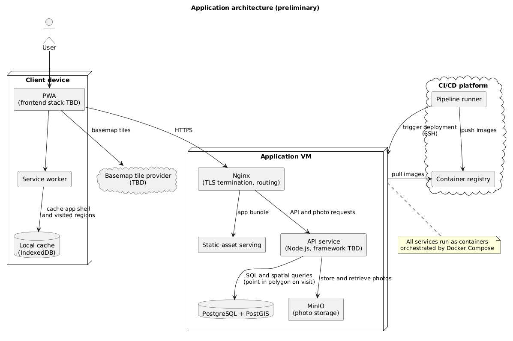

# Architecture

This document describes how the pieces of Sterna fit together: the client, the
backend services, and how they talk to each other. It was written as of
Sprint 0 and is kept up to date as decisions are made; open points are listed
at the end instead of being glossed over.

## Overview

Sterna is a map-centric PWA. The client renders a map, unlocks regions as the
user visits them, and lets the user record visits with photos. The backend is a
single API service backed by PostgreSQL/PostGIS for data and spatial queries,
and MinIO for photo storage. Everything server-side runs as containers on one
VM behind an Nginx reverse proxy, orchestrated with Docker Compose. This
matches the `docker compose up` workflow described in `docs/CONTRIBUTING.md`
and keeps Sprint 0 infrastructure work to a single deployable unit.

**Current implementation status:** the architecture described below is stood
up and running. The CI/CD pipeline builds, tests and deploys the stack
automatically (see `docs/ci_cd.md`); the Nginx reverse proxy, PostgreSQL +
PostGIS and MinIO all run as containers on the school VM behind the single
entry point described here.

## Component diagram

Source: [`architecture.puml`](architecture.puml).

- **PWA**: runs in the browser, registers a
  service worker for offline support.
- **Service worker / IndexedDB**: caches the app shell and the regions the
  user has already visited, so the map stays usable offline.
- **Nginx**: single entry point on the Application VM. Terminates TLS, serves
  the static app bundle, and routes API/photo requests to the right container.
- **API service** (Node.js): the only component that talks to the database
  and to object storage; the client never accesses them directly.
- **PostgreSQL + PostGIS**: stores application data (users, visits, groups,
  progression) and answers spatial queries such as "is this GPS point inside
  this region" when a visit is recorded.
- **MinIO**: S3-compatible object storage for visit photos, self-hosted
  alongside the rest of the stack so we don't depend on a third-party bucket
  during development or grading.
- **Basemap tile provider**: external source of map tiles, loaded directly by
  the client (not proxied through our API).

## Data flow

1. The PWA loads over HTTPS through Nginx, which serves the static bundle.
2. For data, the PWA calls the API over HTTPS through the same Nginx entry
   point; Nginx routes `/api/*`-style requests to the API service container.
3. The API is the only component with credentials to PostgreSQL and MinIO:
   - Reads/writes application data and runs spatial queries (e.g. point-in-polygon
     to decide whether a recorded visit unlocks a region) against
     PostgreSQL/PostGIS.
   - Stores and retrieves photos in MinIO through its S3-compatible API, and
     returns URLs/proxies the bytes back to the client as needed.
4. Basemap tiles are fetched by the client directly from the tile provider;
   they do not go through our API, since they aren't user data.
5. The service worker caches the app shell and previously-loaded visited
   regions in IndexedDB, so the map and past visits remain viewable offline.
   Only new visits/photos require connectivity.

## Key choices and why

- **Single VM + Docker Compose.** The
  project runs for three weeks with a four-person team; a Kubernetes-style
  setup would add operational overhead with no benefit at this scale.
- **PostgreSQL + PostGIS for the database.** The core interaction of the app is a spatial query. PostGIS gives
  us that natively (point-in-polygon, distance queries) instead of us
  reimplementing geometry checks in application code.
- **MinIO for photo storage.**
  Photos are large, user-generated files and don't belong in the relational
  database. MinIO exposes the S3 API, so the API service is written against a
  standard interface and could be pointed at a managed S3-compatible bucket
  later without a rewrite, while staying self-hosted and free for development
  and the grading environment.
- **Nginx as the single reverse proxy / TLS termination point.** It is the
  only container exposed to the outside network; the API, database and MinIO
  are only reachable from inside the Compose network. That limits the attack
  surface and puts TLS certificate handling in one place.
- **The API is the sole gateway to PostgreSQL and MinIO.** The client never
  holds database or MinIO credentials. Authorization logic lives in one place instead of being
  duplicated or bypassed on the client.
- **PWA with an offline-capable service worker.** The map/visit-recording use
  case happens outdoors, where connectivity is unreliable. Caching the app
  shell and already-visited regions keeps the app usable without a network
  connection, and it works without an app-store install.

## Decisions made since the first draft

- **Frontend framework**: React (TypeScript, Vite), targeting the web as a
  PWA (`vite-plugin-pwa`) and mobile via Capacitor. See
  `docs/frontend-stack.md` (ADR-001).
- **Basemap tile provider**: OpenFreeMap vector tiles with a custom MapLibre
  Style JSON, geocoding proxied through the backend to Nominatim. See
  `docs/frontend-stack.md` (ADR-002).
- **Node.js API framework and data access**: NestJS with TypeORM. See
  `docs/decisions/ADR-008-backend-framework.md`.
- **Authentication**: stateless JWT access tokens, argon2id password hashing.
  See `docs/decisions/ADR-009-authentication.md`.

## Deployment and CI/CD

CI/CD (pipeline, container registry, deployment automation) is out of scope
for this document; it is described in `docs/ci_cd.md`. The Nginx / single-VM
deployment layer described in this document is stood up and deployed to on
every merge to `main`.
