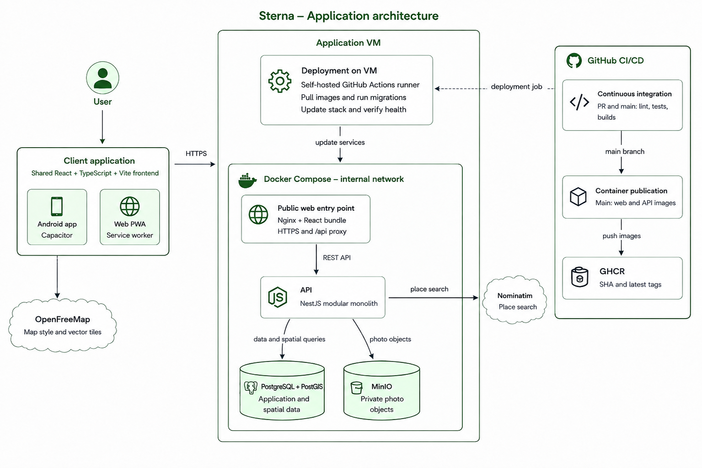

# Architecture

This document describes the architecture of the delivered Sterna application.
It complements the product scope in
[`project_description.md`](../product/project_description.md), the
[`functional requirements`](../product/functional_requirements.md), the
[`non-functional requirements`](../product/non_functional_requirements.md),
and the Architecture Decision Records (ADRs) in [`decisions/`](decisions/).

## 1. Architecture Overview

Sterna is a map-centric application delivered through two clients that share
the same React codebase:

- an installable Progressive Web App (PWA) served over HTTPS;
- an Android application packaged with Capacitor and extended with native
  camera, gallery, geolocation, system-bar, back-button, and QR-scanning
  integrations.

Both clients communicate with a single NestJS REST API. The API owns all
business rules and is the only component allowed to access PostgreSQL/PostGIS
and MinIO. The production server-side stack runs as Docker containers on one
VM behind Nginx.

The architecture is a modular monolith: the backend is deployed as one API
process, while its source is separated into feature modules. This keeps
deployment appropriate for the project's scale without mixing the
responsibilities of authentication, discoveries, groups, photos, points of
interest, geocoding, and health monitoring.

## 2. Client Architecture

### 2.1 Shared React application

The frontend is built with React, TypeScript, and Vite. React Router handles
authenticated routes and navigation, the native Fetch API handles HTTP
requests, and TanStack Query manages remote server state, loading/error states,
mutations, cache invalidation, and short client-side caching. User-dependent
query keys include the signed-in user's ID so cached personal or group data
cannot be reused for another session.

The main interface is organised around Map, Gallery, Add, Groups, and Me:

- **Map** renders the active personal or group exploration with MapLibre GL;
- **Gallery** displays discoveries authored by the user and discoveries shared
  through their groups;
- **Add** captures or selects a photo, obtains metadata and a position, then
  submits a discovery;
- **Groups** manages shared maps, memberships, invitation codes, and QR codes;
- **Me** presents and manages the signed-in user's profile and personal
  exploration statistics.

Authentication state and small interface preferences, such as recent searches
and the selected Gallery layout, are stored locally. Application data remains
authoritative on the server and is fetched through the API.

### 2.2 PWA client

The web build uses `vite-plugin-pwa`. Its generated service worker precaches
the production application shell and static assets and updates automatically.
This improves installation and repeat loading, but Sterna does not implement a
complete offline data store or an offline mutation queue: loading uncached
discoveries, map tiles, and photos, and creating or editing data still requires
network connectivity.

### 2.3 Android client

Capacitor packages the same frontend in an Android WebView. The Android build
does not include the PWA service worker. Native integrations provide:

- camera capture and gallery selection, including temporary-file lifecycle;
- device geolocation and permission handling;
- QR-code scanning for group invitations;
- Android system-bar and back-button behaviour.

The packaged app calls the public HTTPS API from Capacitor's
`https://localhost` origin. The API allows only that additional origin through
its narrowly scoped CORS configuration; the web client remains same-origin.

## 3. Backend Architecture

The backend is a NestJS application written in TypeScript and exposed under
the `/api` prefix. It uses TypeORM for database access, while migrations—not
automatic schema synchronisation—own the production schema.

The main modules are:

- **Auth**: registration, login, current-user retrieval, profile updates,
  password changes, and account deletion;
- **Discoveries**: personal, authored, and group discovery queries plus
  creation, editing, and deletion;
- **Groups**: group lifecycle, memberships, invitation codes, roles, and the
  active-map context;
- **Photos**: image validation, normalisation, ownership metadata, MinIO
  storage, and authenticated delivery;
- **POIs**: the global point-of-interest catalogue and exploration state;
- **Geocoding**: controlled access to Nominatim place search;
- **Health**: the endpoint used by container and deployment checks.

DTO validation is applied globally: unknown fields are rejected, accepted
values are transformed, and constraints are checked before business logic is
executed. A global throttling guard limits normal traffic, with stricter
policies for authentication and uploads. OpenAPI documentation can be enabled
explicitly but is disabled by default in production.

## 4. Data and Storage

### 4.1 PostgreSQL and PostGIS

PostgreSQL stores users, groups, memberships, discoveries, discovery-to-group
associations, photo ownership metadata, the POI catalogue, and country
geometries. PostGIS stores discovery and POI positions as WGS 84 points and
supports the spatial operations central to the product.

Important relationships and invariants include:

- a discovery has one author and may be visible on the author's personal map,
  one or more group maps, or both;
- group membership stores the `owner` or `member` role and whether that group
  is the user's active map;
- a partial unique index permits at most one active group per user; no active
  group means the personal map is active;
- country geometries and spatial indexes support country attribution;
- POI exploration is derived from accessible discoveries within 150 metres,
  rather than stored as a separate mutable flag.

The API performs personal and group filtering in its SQL queries. The client
also keeps user-specific caches separate, but client-side filtering is not a
security boundary.

### 4.2 MinIO photo storage

Photo bytes are stored as generated object keys in a private MinIO bucket;
they are not stored in PostgreSQL. The database records each object's uploader
and references the relevant keys from discoveries or user avatars.

The browser and Android application never receive MinIO credentials and do not
access MinIO directly. Uploads and reads pass through authenticated API routes,
where ownership or access through a personal/group discovery is checked.
Image inputs are validated and re-encoded before storage. Deletion workflows
remove objects that are no longer referenced, including during discovery or
account deletion.

## 5. Geospatial and External Services

MapLibre GL renders the interactive map. OpenFreeMap supplies the external
vector basemap and style resources directly to the client; these public map
resources do not pass through the Sterna API.

The frontend renders a country veil from bundled geographic data. When a
discovery is created or moved, PostGIS assigns it to a country using polygon
containment, with a small nearest-country fallback to compensate for simplified
coastlines. The same database layer evaluates whether an accessible discovery
is within the 150-metre radius of a catalogue POI.

Online place search is proxied by the API to Nominatim. This keeps provider
policy in one place: requests are serialised to at most one per second, results
are cached in memory for five minutes, and upstream failures become a stable
service-unavailable API response. Search also combines those online places
with accessible Sterna discoveries and POIs on the client.

## 6. Authentication, Authorization, and Security Boundaries

Authentication uses stateless JWT access tokens. Email addresses are
normalised, while passwords are hashed with Argon2id; password hashes are
excluded from ordinary database queries. A password change records its time so
tokens issued earlier can be rejected.

Except for registration, login, and health checks, API operations require an
authenticated user. Authorization is enforced by the API and database query
conditions:

- personal data is restricted to its owner;
- group data requires current membership;
- group administration requires the owner role;
- a user can edit or delete only discoveries they authored;
- photo delivery requires ownership or access to a discovery that references
  the object.

Nginx is the only public server-side entry point. PostgreSQL, MinIO, and the
API have no directly published production ports. TLS, HTTP-to-HTTPS redirects,
Content Security Policy, and other browser security headers are handled at the
web edge; the API additionally uses Helmet. Secrets are supplied through the
deployment environment and are not included in the images or repository.

## 7. Principal Data Flows

### 7.1 Login and authenticated requests

1. The client submits credentials to `/api/auth/login` through Nginx.
2. The API verifies the Argon2id password hash and returns a JWT plus the user
   representation.
3. The client stores the session and sends the token as a bearer token.
4. The global JWT guard validates the token and exposes the user ID to the
   requested module, which applies its authorization rules.

### 7.2 Discovery creation

1. The user captures or selects a photo. The client reads available EXIF
   metadata and lets the user confirm or replace the date and position.
2. The client uploads the image to the authenticated photo endpoint.
3. The API validates and normalises the image, stores it in MinIO, and records
   its owner in PostgreSQL.
4. The client creates the discovery using the returned object key and selected
   personal/group destinations.
5. The API validates those destinations, stores the PostGIS point, attributes
   its country, and links the discovery to the permitted group maps.
6. Relevant client queries are invalidated so Map, Gallery, Groups, POIs, and
   profile statistics reflect the change.

### 7.3 Active-map reads

1. The client retrieves the user's active-map context.
2. With no active group, the personal map returns only the signed-in user's
   discoveries marked for personal visibility.
3. With an active group, the group map returns discoveries shared to that
   group by its members and includes each author's display name.
4. POI exploration is calculated against the same active context, keeping the
   map, POI state, and discovery list consistent.

## 8. Deployment Architecture

Production uses Docker Compose on a single school VM:

- **web** contains Nginx and the compiled React application, exposes ports 80
  and 443, terminates TLS, redirects HTTP to HTTPS, and proxies `/api`;
- **api** runs the compiled NestJS application only on the internal network;
- **postgres** runs PostgreSQL 16 with PostGIS and persists its data in a named
  volume;
- **minio** stores photos in a named volume and remains private;
- **minio-init** creates the configured private bucket when needed;
- **certbot** renews the Let's Encrypt certificate shared with Nginx.

This topology is intentionally simple and suitable for the project's load and
operational context. Its trade-off is that the VM remains a single point of
failure; horizontal scaling and multi-node failover are not implemented.

## 9. Continuous Integration and Deployment

GitHub Actions validates pull requests and pushes to `main` with parallel
frontend, API, and Android jobs. They run linting, automated tests, production
builds, container builds, and an Android debug build as applicable.

After a change reaches `main`, the deployment workflow:

1. builds the web and API production images;
2. publishes immutable commit-SHA tags and `latest` tags to GitHub Container
   Registry (GHCR);
3. runs on a self-hosted runner located on the target VM;
4. pulls the images, applies database migrations before starting the API, and
   starts the Compose stack;
5. checks the API container health and verifies the HTTP redirect, HTTPS app,
   and `/api/health` route through Nginx.

The VM pulls artifacts from GHCR; the workflow does not deploy over SSH. A
separate workflow builds and publishes a signed APK when a `v*` release tag is
pushed. Operational details are documented in [`ci_cd.md`](ci_cd.md).

## 10. Key Architecture Decisions

The rationale and alternatives for the principal choices are recorded in:

- [ADR-001: Frontend Platform](decisions/ADR-001-frontend-platform.md)
- [ADR-002: Mapping Stack](decisions/ADR-002-mapping-stack.md)
- [ADR-003: Backend Architecture](decisions/ADR-003-backend-architecture.md)
- [ADR-004: Database](decisions/ADR-004-database.md)
- [ADR-005: Country Detection](decisions/ADR-005-country-detection.md)
- [ADR-006: Photo Storage](decisions/ADR-006-photo-storage.md)
- [ADR-007: Deployment Architecture](decisions/ADR-007-deployment-architecture.md)
- [ADR-008: Backend Framework](decisions/ADR-008-backend-framework.md)
- [ADR-009: Authentication](decisions/ADR-009-authentication.md)

The central trade-off is deliberate: Sterna favours one shared client, one
modular API, and one containerised VM over distributed services. This reduces
delivery and operational complexity while retaining clear module, storage,
authorization, and deployment boundaries that can evolve independently if the
application grows.
